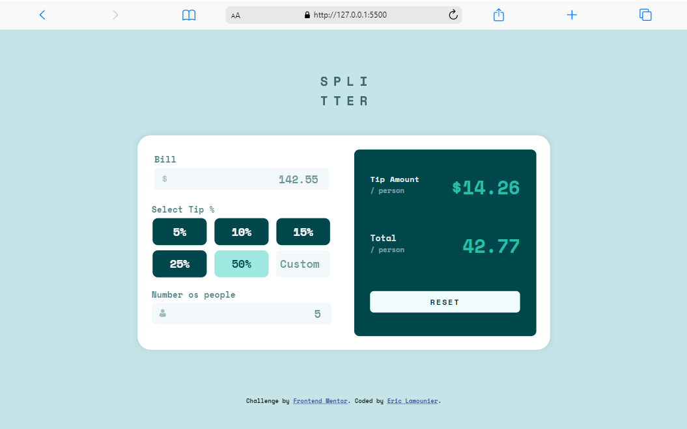
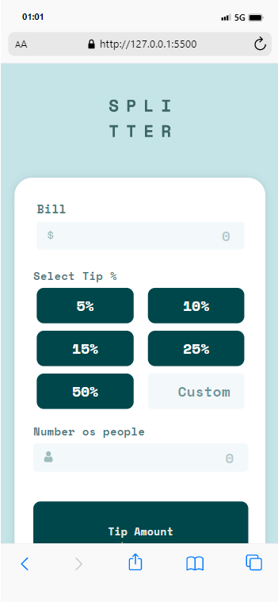

# Calculadora de Gorjeta - Tip Bill

    
    

Projeto construído utilizando os conceitos básicos de HTML5, CSS3 e JavaScript.

[Clique aqui para acessar a página](https://ericlamounier.github.io/Tip-Bill/)

## Tecnologias

- HTML5
- CSS3
- JavaScript

## Contato
eric.botelho@ufv.br

eric_lamounier@outlook.com